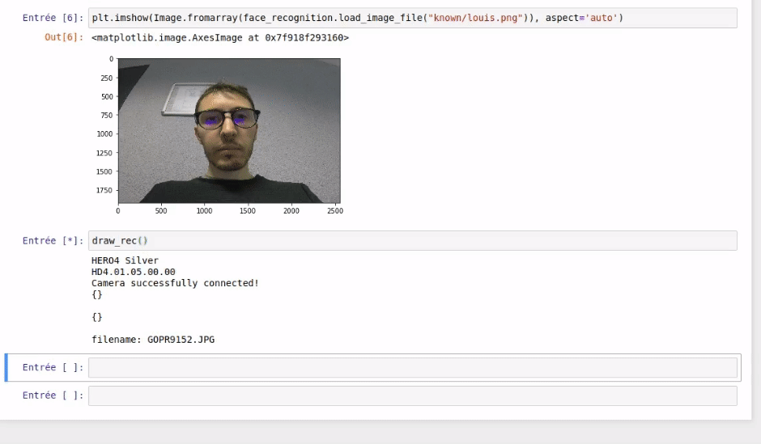
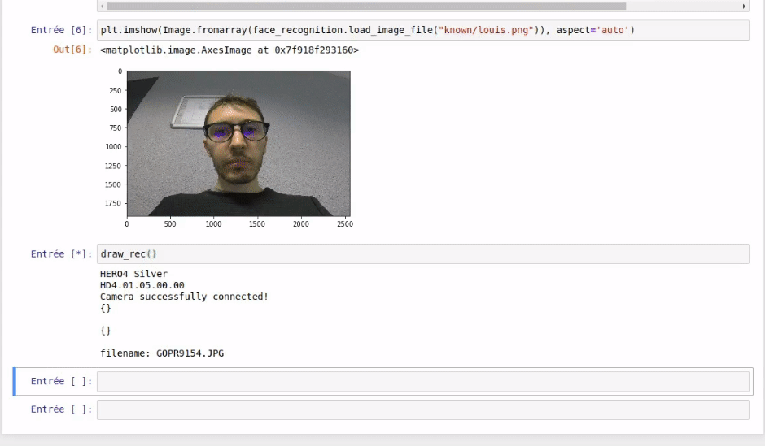

# Facial recognition

Face recognition using gopro camera



### Hack with phone picture



## Installation

First [install dlib](https://gist.github.com/ageitgey/629d75c1baac34dfa5ca2a1928a7aeaf)

Then

```
pip install -r requirements.txt
```

## Usage

Connect to your gopro wifi, run the jupyter notebook